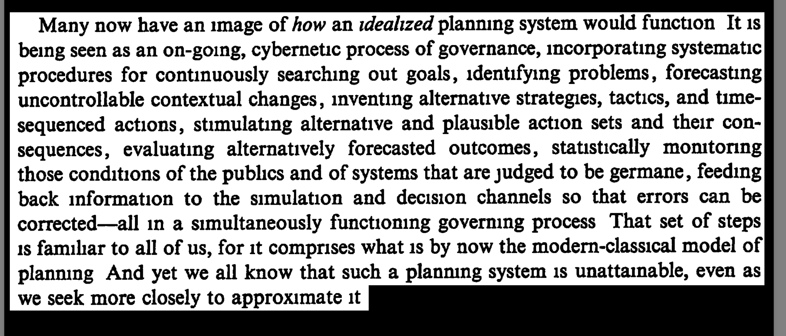

Welp here are my notes from the CS 222 AI course.
I'm going to go week by week and I'll link the resources I used to make the notes.
Plus any thoughts I have while making the notes.

the course website is here https://joonspk-research.github.io/cs222-fall24/index.html

IF someone doesn't want to go through all the slides and readings, the idea is you can skim my notes and take some key points.

## Lecture 2: The Wicked Problem 

Some key questions:

What is a wicked problem?

### What is a wicked problem?
Wicked problems are complex, ill-defined social or policy challenges that defy straightforward solutions

Reference for concept.This was an amazing read for me
H. W. J. Rittel, M. M. Webber, Dilemmas in a general theory of planning. Policy Sciences 4, 155-169 (1973).
- a program that defines an environment and the behaviors of agents then outputs the resulting world

More formally…
W(t): The world’s state over time .
: The environment, defined by a set of state and rules that govern
the environment’s dynamics.
Ai: Individual agent in the environment, where for agents.

side note this seems really RL coded

